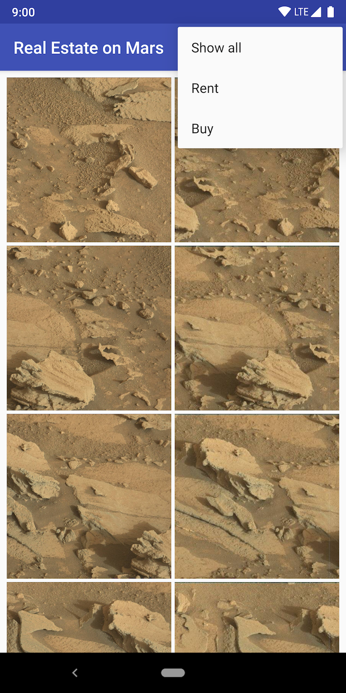

## MarsRealEstate

A small project to to receive the Mars Property images from API using Retrofit, where you can filter the output result into Recycler View by real estate type(for rent, sale or all) and see details of selected real estate property.

##

  

      

         

  
 

##

MarsRealEstate is a simple demo app using ViewModel & LiveData with Retrofit, Glide and Moshi in Kotlin.

This app demonstrates the following views and techniques:

* [Retrofit](https://square.github.io/retrofit/) to make api calls to an HTTP web service
* [Moshi](https://github.com/square/moshi) which handles the deserialization of the returned JSON to Kotlin data objects 
* [Glide](https://bumptech.github.io/glide/) to load and cache images by URL.
  
It leverages the following components from the Jetpack library:

* [ViewModel](https://developer.android.com/topic/libraries/architecture/viewmodel)
* [LiveData](https://developer.android.com/topic/libraries/architecture/livedata)
* [Data Binding](https://developer.android.com/topic/libraries/data-binding/) with binding adapters
* [Navigation](https://developer.android.com/topic/libraries/architecture/navigation/) with the SafeArgs plugin for parameter passing between fragments

## Screenshots

